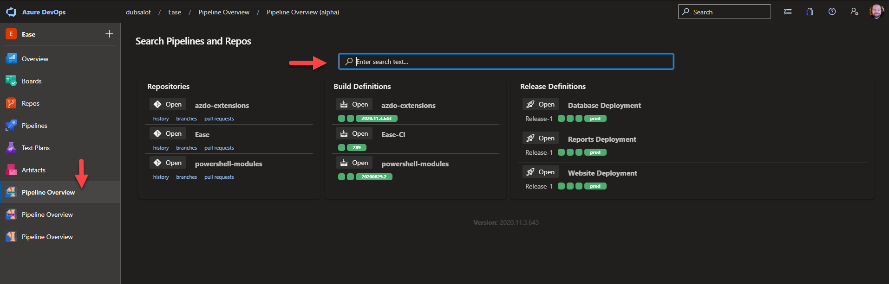

# Introduction 
This project is an extension for [Azure DevOps](https://azure.microsoft.com/en-us/services/devops/) henceforth referred to as azdo or AzDo. The goal is to consolidate some of the azdo screens into one hub. AzDo is a great product made out of 100% awesome, *but* I find navigating some of the screens that I use all day everyday to be annoying. Granted, some of this is because of the my company organizes and names its projects.

For example, we have 80 applications in my department. Each one has a repository, a release definition, and a build definition. We are using the classic builds/releases. The are all named with their "app code" which is a thing internal to my company. An example might be WMABC. Thefore, I will have a repo, a build defintion, and a release definition named WMABC along with 79 other applications. Each section in AzDo has it's own UI where a user can search for what they are looking for. 

It all starts blurring together, honestly. Granted, this is a personal preference, I'd rather have those things in one place with one search box. That's the primary goal of the extension.

# Getting Started
TODO: Guide users through getting your code up and running on their own system. In this section you can talk about:
1.	Installation process
2.	Software dependencies
3.	Latest releases
4.	API references

# Build and Test
TODO: Describe and show how to build your code and run the tests. 

# Contribute
TODO: Explain how other users and developers can contribute to make your code better. 

If you want to learn more about creating good readme files then refer the following [guidelines](https://docs.microsoft.com/en-us/azure/devops/repos/git/create-a-readme?view=azure-devops). You can also seek inspiration from the below readme files:
- [ASP.NET Core](https://github.com/aspnet/Home)
- [Visual Studio Code](https://github.com/Microsoft/vscode)
- [Chakra Core](https://github.com/Microsoft/ChakraCore)
